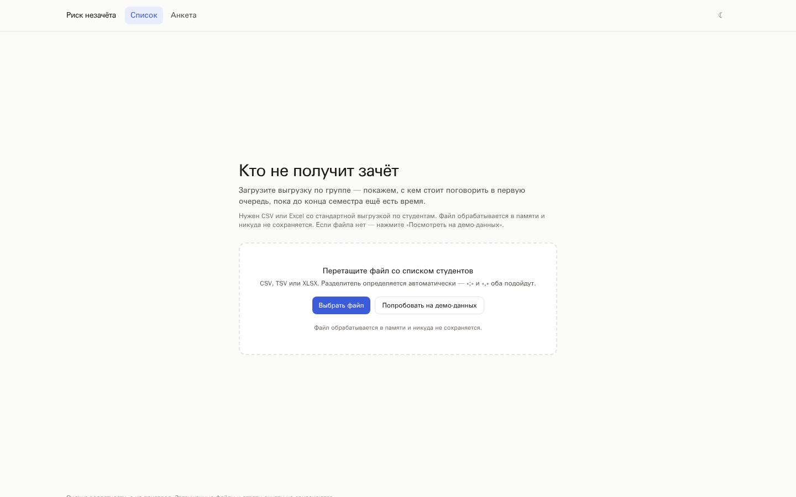
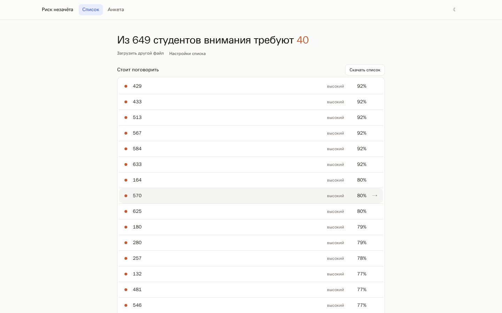
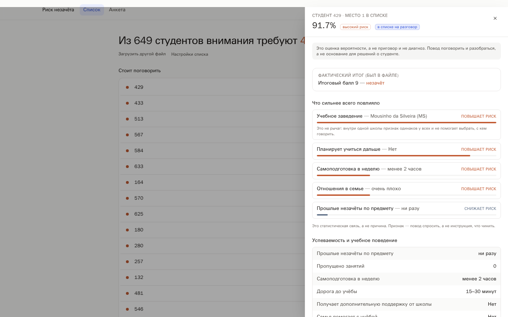
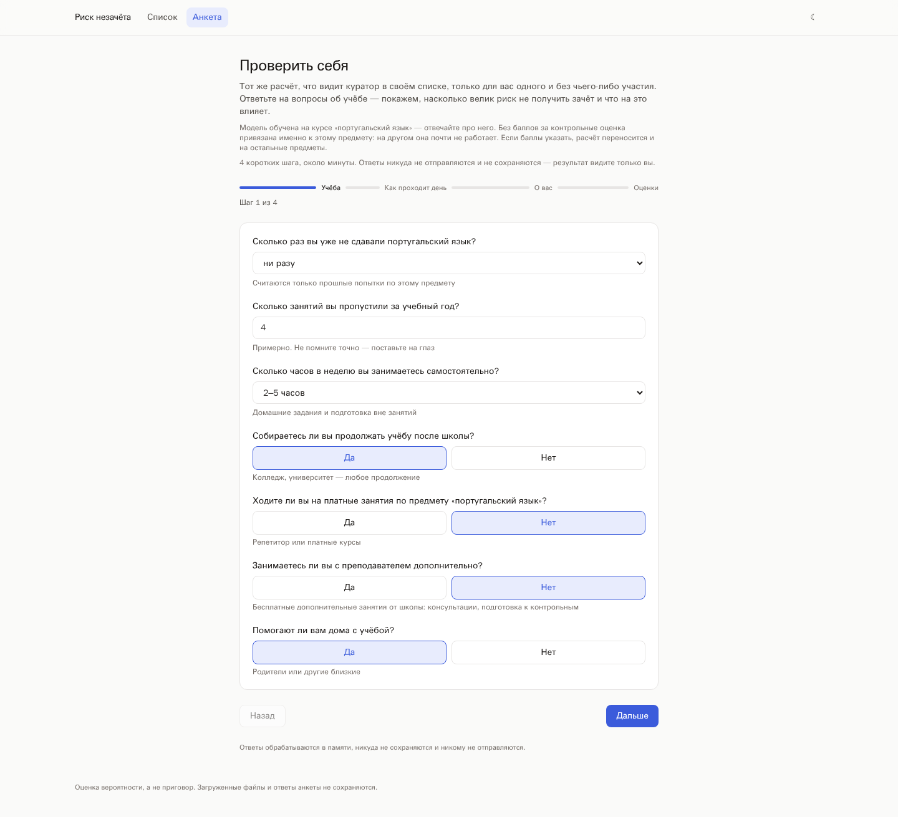
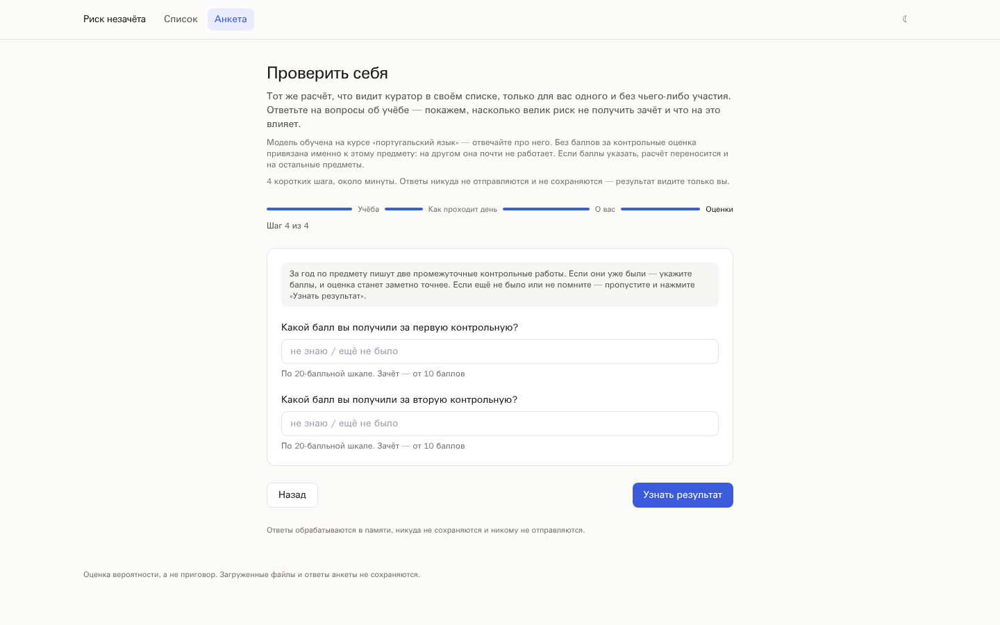
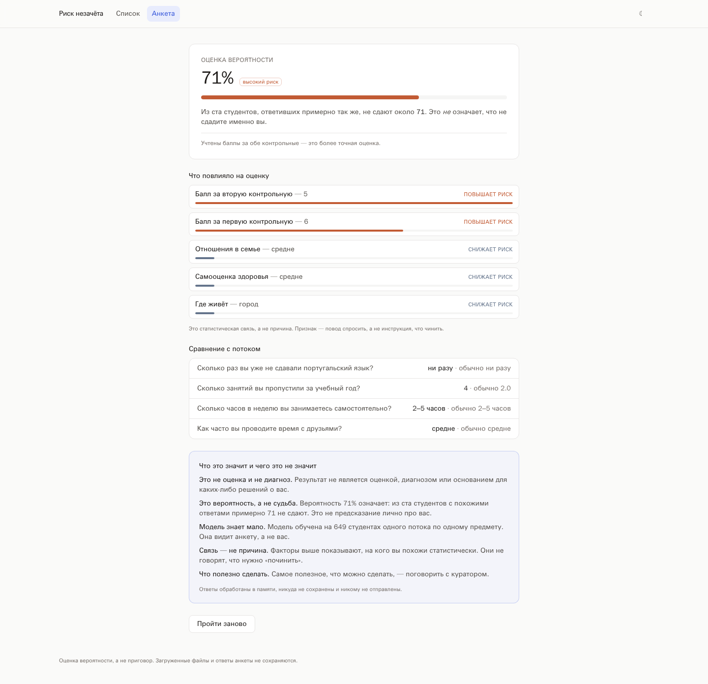
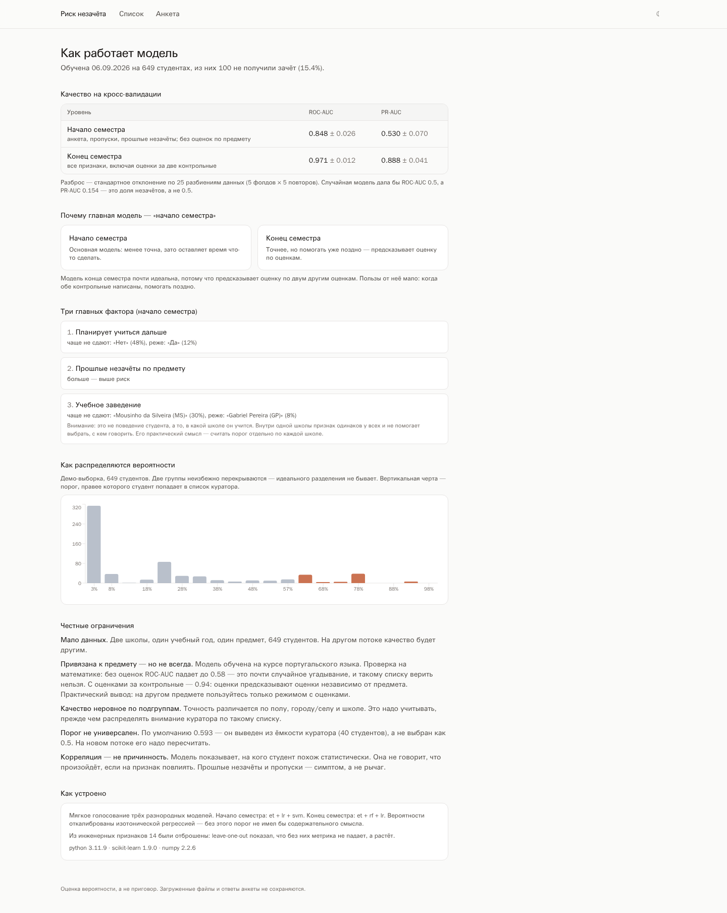
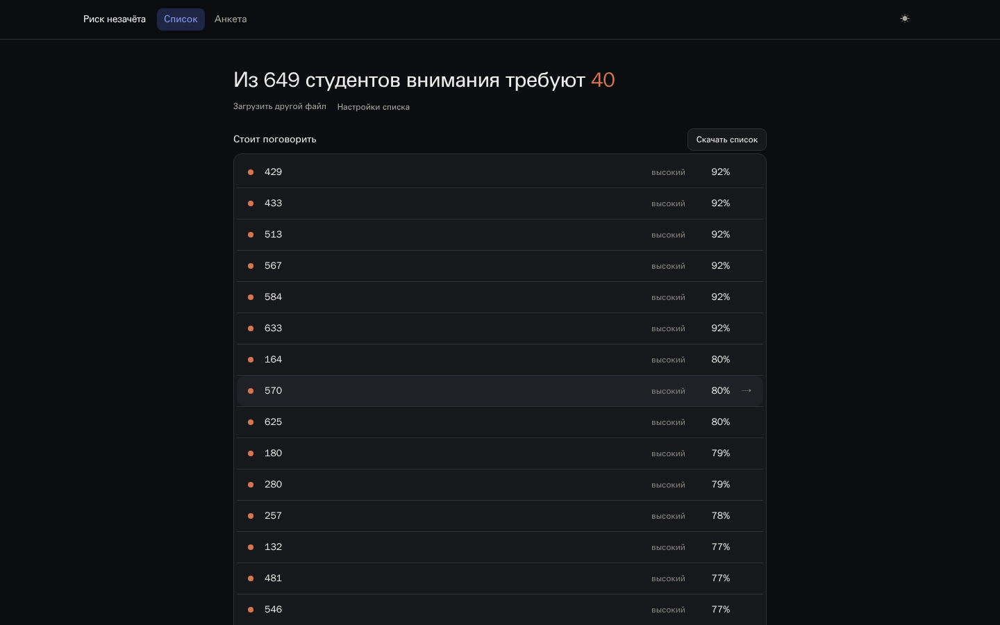
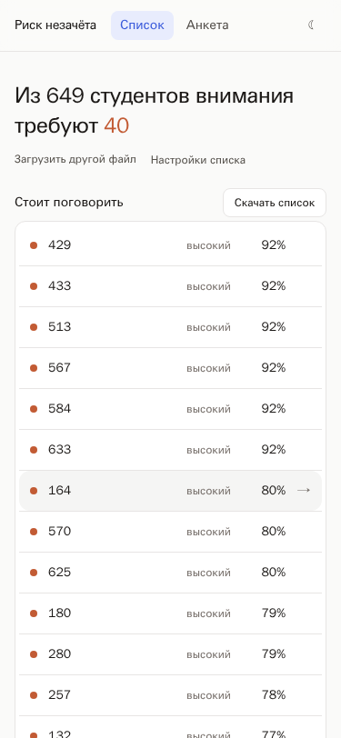

# Риск незачёта — веб-приложение

Инструмент для куратора: загрузить выгрузку по студентам и получить короткий
список тех, с кем стоит поговорить до того, как станет поздно. Плюс анкета:
студент может сам проверить себя тем же расчётом, без чьего-либо участия.

Поверх готовой модели из `risk.ipynb` — те же числа, без переобучения
и «улучшений» по дороге.

---

## Быстрый старт

```bash
git clone <repo> && cd hack
docker compose up --build
```

Открыть **http://localhost:3000**. API и Swagger — на http://localhost:8000/docs.

Переобучение не требуется: артефакты модели лежат в `riskml/artifacts/`
и закоммичены (10 МБ на две модели).

```bash
make up      # то же самое в фоне
make logs    # логи
make down    # остановить
make test    # тесты бэкенда
make train   # переобучить модель
```

---

## Структура репозитория

```
├── data/                   исходные данные кейса (student-por.csv, student-mat.csv)
├── riskml/                 ML-пакет: пайплайн, схема признаков, обучение
│   └── artifacts/          готовые модели + metadata.json (коммитятся)
├── backend/                FastAPI: API, загрузка файлов, объяснения, тесты
├── frontend/               React + TypeScript + Vite, отдаётся через nginx
├── research/               исследование: ноутбук, эксперименты, отчёт
├── docs/                   скриншоты и условие кейса
├── tools/                  вспомогательные скрипты (снятие скриншотов)
└── docker-compose.yml      два сервиса: backend и frontend
```

**`riskml/` — единственный мост между исследованием и продуктом.** Он ставится
и в образ обучения, и в образ бэкенда, и это не удобство, а необходимость:
`joblib` пиклит `engineer()` по ссылке на модуль, поэтому без импортируемого
`riskml.pipeline` готовая модель не загрузится.

`research/` в Docker-контекст не входит — в продукт едет только артефакт модели.

---

## Как это выглядит

Скриншоты сняты с боевого сайта скриптом `tools/screenshots.js` — не нарисованы
и не подобраны вручную.

**Первый экран.** Заголовок, строка о том, что это, зона загрузки. Никаких
метрик и графиков, пока не спросили.



**Список.** Ответ на единственный вопрос куратора — с кем говорить. В строке
только номер, уровень и процент: причина риска живёт в карточке, потому что
сорок пояснений подряд всё равно не читаются.



**Карточка студента** — по клику на строку. Здесь всё: что повлияло именно
у этого человека и все признаки с человеческими подписями
(`studytime=2` → «2–5 часов», `Medu=4` → «высшее»).



**Анкета для студента.** Вопросы сформулированы как вопросы и понятны без
знания датасета. Предмет назван прямо: «Сколько раз вы уже не сдавали
португальский язык?»



**Оценки — необязательный шаг.** Если контрольные уже были, расчёт переходит
на модель конца семестра и становится заметно точнее.



**Результат анкеты.** Вероятность, что на неё повлияло, сравнение с потоком
и обязательный блок «что это значит и чего это не значит».



**Как работает модель** — отдельная страница, доступная по прямой ссылке
`/model`. Всё аналитическое переехало сюда. Числа тянутся из `/api/model-info`,
в вёрстке их нет.



**Тёмная тема и мобильная вёрстка (375 px).**

| Тёмная тема | Мобильный |
|---|---|
|  |  |

---

## Проверено запуском

| Что | Результат |
|---|---|
| `docker compose up --build` из чистой копии | поднимается, backend healthy за ~5 с |
| `student-por.csv` с `;` | 649 строк, 2.5 с |
| тот же файл с `,` | 649 строк |
| `student-mat.csv` | средний риск 0.232 против 0.161 на португальском |
| файл без `G1`/`G2` | автоматически L2, уровень показан в UI |
| битый / пустой / чужой файл | 400 и 422 с подсказками, ни одного 500 |
| паритет с ноутбуком | `max abs Δp < 1e-6` |
| `make test` | 42 теста |
| Lighthouse (главная) | производительность **96**, доступность **100** |
| мобильная вёрстка 375 px | горизонтальный overflow ровно 0 |
| размеры образов | фронтенд **20.8 МБ**, бэкенд **622 МБ** |

---

## Что внутри

| Страница | Для кого | Что делает |
|---|---|---|
| **Список** | куратор | загрузка CSV/XLSX → список по убыванию риска, карточка студента, экспорт |
| **Анкета** | студент | 16 вопросов + необязательные баллы за контрольные → вероятность и что на неё повлияло |
| **Как работает модель** | жюри, любопытные | метрики обоих уровней, три фактора, распределение, ограничения. В меню не выведена, открывается по ссылке `/model` |

### Две модели и автовыбор

| Уровень | Признаки | Когда работает | ROC-AUC | PR-AUC |
|---|---|---|---|---|
| **L2** — начало семестра | анкета, пропуски, прошлые незачёты | до первой контрольной | **0.848 ± 0.026** | **0.530 ± 0.070** |
| **L1** — конец семестра | всё, включая `G1`, `G2` | после двух контрольных | **0.971 ± 0.012** | **0.888 ± 0.041** |

Метрики — `среднее ± стандартное отклонение` по `RepeatedStratifiedKFold`
(5 фолдов × 5 повторов = 25 оценок). Они совпадают с ноутбуком до четвёртого
знака — это проверяется тестом и падением `make train`, если разойдётся.

Уровень выбирается **автоматически**: есть в файле `G1` и `G2` → L1, нет → L2.
В интерфейсе всегда написано, какой уровень применён и что это значит.
Основная модель — L2: она менее точна, зато оставляет время что-то сделать.

---

## Порог и ёмкость куратора

Порог **не 0.5**. По умолчанию `0.593` — он выведен из ёмкости куратора
(40 студентов из 649), а не выбран как «красивое число». При 15.4 % незачётов
порог 0.5 оставил бы большинство студентов в зоне риска без внимания.

Ёмкость настраивается в «Настройках списка» — они свёрнуты, потому что
значение по умолчанию подходит большинству. Список и метрики
`precision@K` / `recall@K` пересчитываются на лету на фронтенде, без
повторного запроса к серверу.

`precision@K` и `recall@K` показываются, только если в файле есть фактический
итог (`G3`). Без него честно показывается лишь размер списка.

---

## Утечки и режим проверки

`G3` не попадает в признаки **никогда** — ни в пакетном режиме, ни в анкете.
Это проверяется тестом `test_g3_never_reaches_features`: файл с перевёрнутой
`G3` обязан дать побайтово те же вероятности.

Если `G3` в файле есть, включается отдельный, явно помеченный **режим проверки**:
считаются ROC-AUC, PR-AUC и матрица ошибок, а у каждого студента появляется
фактический итог. Это не рабочий режим прогноза.

Демо-данные (`student-por.csv`) — это **обучающая выборка**, поэтому метрики
режима проверки на них завышены. Приложение говорит об этом прямо.

---

## Персональные объяснения

Для каждого студента показываются 3–5 факторов, сильнее всего сдвинувших его
вероятность вверх и вниз. Метод — вклад признака относительно типичного
значения по выборке: значение подменяется медианой/модой, и измеряется, как
изменилась вероятность.

SHAP не используется **осознанно**: `TreeExplainer` на калиброванном ансамбле
из 866-деревного ExtraTrees + SVM не укладывается в требование «ответ за 3
секунды». Все возмущения склеиваются в один вызов `predict_proba` — у модели
большая фиксированная стоимость вызова (1.31 мс/строку на 649 строках против
0.27 мс/строку на 7788), поэтому восемь отдельных прогонов стоили бы ~8 секунд,
а один склеенный — около полутора. Итог: **2.5 с на 649 строк**.

Формулировки человеческие: «два прошлых незачёта — сильнее всего повышает
риск», а не «feature failures = 2, shap +0.31».

⚠️ Признак `school` (учебное заведение) — второй по силе, но **не рычаг**:
внутри одной школы он одинаков у всех и не помогает выбрать, с кем говорить.
Если он попадает в топ-факторы, рядом печатается отдельная оговорка.

---

## API

Базовый префикс `/api`. Полная схема — на `/docs`.

| Метод | Путь | Что делает |
|---|---|---|
| `GET` | `/health` | статус, загружена ли модель, версии библиотек |
| `GET` | `/schema` | описание всех признаков: лейблы, типы, расшифровка кодов, группы, шаги анкеты |
| `GET` | `/model-info` | метрики обеих моделей, порог, важности, состав ансамбля |
| `POST` | `/predict/batch` | `multipart/form-data`: `file`, опционально `level`, `threshold` |
| `POST` | `/predict/demo` | то же на приложенном `student-por.csv` |
| `POST` | `/predict/single` | `{"answers": {...}}` — одна анкета. Отвечать можно частично: неспрошенное подставляется типичным значением потока, в ответе приходит `defaults_used`. Если заданы оба балла `G1`/`G2` — считает моделью конца семестра |
| `POST` | `/export` | `{"rows": [...], "format": "csv"\|"xlsx"}` → файл |

**Фронтенд строит анкету и карточку студента из `/api/schema`**, а не из
хардкода: чтобы добавить признак, достаточно поправить `riskml/schema.py`.

Ошибки всегда в одном формате, по-русски и без трейсбеков:

```json
{"error": {"message": "...", "hint": "...", "details": {...}}}
```

### Что переживает загрузка

* разделитель `;`, `,`, `\t`, `|` — определяется автоматически (`csv.Sniffer`
  с фолбэком на подсчёт кандидатов в заголовке);
* кодировки utf-8, utf-8-sig, cp1251, latin-1;
* `.csv`, `.tsv`, `.xlsx`;
* лишние колонки — игнорируются молча;
* не хватает колонок — 422 со списком и fuzzy-подсказкой про опечатки
  («`failure` → `failures`»);
* пропуски — заполняются внутри пайплайна, строки не выбрасываются;
  в ответе приходит `data_quality`.

Лимиты: 10 МБ и 20 000 строк, 30 запросов в минуту на IP.

---

## Приватность

Загруженные файлы и ответы анкеты обрабатываются **в памяти** и никуда не
записываются: ни на диск, ни в базу, ни в логи. Базы данных в проекте нет
вообще. В логи пишутся только имя файла, число строк и определённый
разделитель.

---

## Как переобучить

```bash
make train    # = python -m riskml.train --data data/student-por.csv               #                          --reference research/results.json
```

Скрипт:

1. заново считает leave-one-out отбор инженерных признаков (не хардкод —
   так артефакт всегда согласован с кодом пайплайна);
2. считает 5×5 CV и **сверяет с `research/results.json` ноутбука**, падая при
   расхождении больше 0.01;
3. обучает обе модели с калибровкой и сохраняет в `riskml/artifacts/`;
4. выводит порог из ёмкости куратора;
5. пишет `metadata.json`: версии, метрики, важности, фон для объяснений,
   схему признаков, sha256 обучающего файла.

Занимает около двух минут.

> **Версии обязаны совпадать.** `joblib`-артефакт, собранный на одной версии
> scikit-learn и загруженный на другой, — самая частая причина падения такого
> сервиса. Поэтому версии в `backend/requirements.txt` пиннятся жёстко, а
> `riskml/` копируется в образ бэкенда: `joblib` пиклит `engineer()` по ссылке
> на модуль, и без импортируемого `riskml.pipeline` модель не загрузится.

---

## Разработка

```bash
docker compose -f docker-compose.yml -f docker-compose.dev.yml up   # hot reload
make test    # 42 теста бэкенда
make lint
```

Тесты покрывают: happy path, `;` против `,`, tab, cp1251, xlsx, файл без
`G1`/`G2`, файл с `G3`, битый файл, пустой файл, только заголовок, лишние
колонки, опечатки в колонках, кастомный порог, экспорт, анкету, и отдельно —
что `G3` не влияет на вероятность.

Два теста паритета с ноутбуком:

* **< 1e-6** — артефакт против пайплайна, пересобранного из кода ноутбука
  и обученного тем же сидом. Ловит любую попытку «улучшить» модель;
* **≤ 0.01** — метрики против `results.json`.

Прямое сравнение вероятностей с ноутбуком по строкам невозможно: там они
out-of-fold (`cross_val_predict`), то есть каждая строка предсказана моделью,
которая её не видела. Модель в продукте обучена на всех данных, поэтому на тех
же строках её вероятности обязаны отличаться — это разные величины, а не
расхождение реализаций.

---

## Исследование

Ноутбук, эксперименты и отчёт по построению модели — в [`research/`](research/README.md).
В продукт оттуда ничего не входит: модель приезжает готовым артефактом,
а сам каталог исключён из Docker-контекста.

---

## Ограничения

1. Две школы, один учебный год, один предмет, 649 студентов.
2. Порог подобран на этих данных — на новом потоке пересчитать.
3. **Без оценок модель привязана к предмету.** Обучена на курсе португальского
   языка. Проверка переносом на математику: без оценок ROC-AUC падает
   до **0.581** — это почти монетка, такому списку верить нельзя. С баллами
   за контрольные — **0.944**, потому что оценки предсказывают оценки
   независимо от предмета. Для сравнения, потолок на самой математике без
   оценок всего 0.676: дело не в переносе, а в том, что сигнала там мало
   в принципе. Практический вывод: на другом предмете пользуйтесь только
   режимом с оценками.
4. Качество неровное по подгруппам (пол, город/село, школа).
5. Часть признаков — самооценка студента (алкоголь, здоровье, свободное время).
6. **Корреляция — не причинность.** Прошлые незачёты и пропуски — симптом,
   а не рычаг. Фактор — повод спросить, а не инструкция, что чинить.

## Этика

Приложение нигде не подаёт вероятность как приговор — ни текстом, ни цветом.
Шкала риска сделана намеренно не светофором: градиент от нейтрального
сине-серого к приглушённому терракотовому, без красной мигающей плашки
«ВЫСОКИЙ РИСК», которая читалась бы как клеймо.

На экране результата анкеты блок «что это значит и чего это не значит» —
обязательная часть страницы, а не мелкий шрифт внизу: результат не является
оценкой, диагнозом или основанием для решений; вероятность 30 % означает, что
из ста похожих студентов не сдают примерно тридцать, а не что «ты не сдашь».

Ложноположительные срабатывания дороже, чем кажется: зря вызванный студент
рискует получить ярлык, а прогноз — сбыться именно потому, что был сделан.
Список не следует показывать студенту; разговор должен быть поддерживающим.
